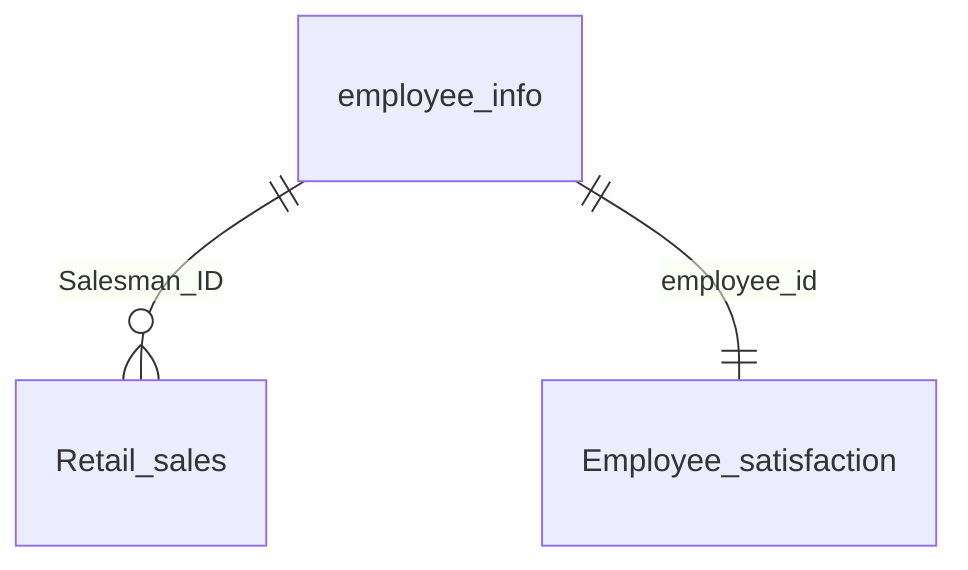

# Retail Sales Pipeline Documentation

## Overview

This documentation describes the relationship between three main tables: `employee_info`, `Retail_sales`, and `Employee_satisfaction`.

### Table Relationships
- `employee_info` is the main employee table containing basic employee information
- `Retail_sales` connects to `employee_info` through `Salesman_ID = employee_id`
- `Employee_satisfaction` connects to `employee_info` through `employee_id`



## Table Specifications

### employee_info
Primary table containing core employee data.

```sql
CREATE TABLE CDDtest.dbo.employee_info (
    employee_id int NOT NULL,              -- Unique identifier for each employee
    First_name nvarchar(50) NOT NULL,      -- Employee's first name
    Last_name nvarchar(50) NOT NULL,       -- Employee's last name
    Salary int NOT NULL,                   -- Employee's salary
    Job_title nvarchar(50) NOT NULL        -- Employee's job title
);
```

### Retail_sales
Contains retail transaction data linked to sales employees.

```sql
CREATE TABLE CDDtest.dbo.Retail_sales (
    InvoiceNo nvarchar(50) NULL,           -- Unique identifier for each sale transaction
    StockCode nvarchar(50) NULL,           -- Product identifier code
    Description nvarchar(50) NULL,         -- Product description
    Quantity nvarchar(50) NULL,            -- Number of items sold
    InvoiceDate datetime2 NULL,            -- Date and time of the sale
    UnitPrice float NULL,                  -- Price per unit of the product
    CustomerID int NULL,                   -- Unique identifier for each customer
    Salesman_ID int NULL,                  -- References employee_id from employee_info
    Country nvarchar(50) NULL              -- Country where the sale occurred
);
```

### Employee_satisfaction
Contains employee satisfaction metrics and performance data.

```sql
CREATE TABLE CDDtest.dbo.Employee_Info (
    employee_id int NULL,                                  -- Employee identifier
    Education nvarchar(50) NULL,                           -- Education level
    EnvironmentSatisfaction nvarchar(50) NULL,             -- Workplace environment rating
    JobInvolvement nvarchar(50) NULL,                      -- Level of job involvement
    JobSatisfaction nvarchar(50) NULL,                     -- Overall job satisfaction
    PerformanceRating int NULL,                            -- Employee performance score
    RelationshipSatisfaction nvarchar(50) NULL,            -- Work relationship rating
    WorkLifeBalance nvarchar(50) NULL                      -- Work-life balance rating
);
```

## Example Queries

### 1. Sales Performance by Salesman
```sql
SELECT 
    e.First_name + ' ' + e.Last_name AS Salesman_Name,
    COUNT(r.InvoiceNo) AS Total_Sales,
    SUM(r.Quantity * r.UnitPrice) AS Total_Revenue
FROM CDDtest.dbo.Retail_sales r
JOIN CDDtest.dbo.employee_info e ON r.Salesman_ID = e.employee_id
GROUP BY e.First_name, e.Last_name
ORDER BY Total_Revenue DESC;
```

### 2. Employee Satisfaction vs Performance
```sql
SELECT 
    ei.First_name + ' ' + ei.Last_name as Employee_Name,
    ei.Job_title,
    es.JobSatisfaction,
    es.PerformanceRating
FROM CDDtest.dbo.employee_info ei
JOIN CDDtest.dbo.Employee_satisfaction es 
    ON ei.employee_id = es.employee_id
WHERE es.PerformanceRating > 3;
```

### 3. Top Products by Country
```sql
SELECT 
    Country,
    Description,
    SUM(CAST(Quantity AS int)) AS Total_Quantity_Sold,
    SUM(CAST(Quantity AS int) * UnitPrice) AS Total_Revenue
FROM CDDtest.dbo.Retail_sales
GROUP BY Country, Description
ORDER BY Country, Total_Revenue DESC;
```

### 4. Salesman Performance by Quarter
```sql
SELECT 
    e.First_name + ' ' + e.Last_name AS Salesman_Name,
    DATEPART(QUARTER, r.InvoiceDate) AS Quarter,
    DATEPART(YEAR, r.InvoiceDate) AS Year,
    COUNT(DISTINCT r.InvoiceNo) AS Number_of_Sales,
    SUM(CAST(r.Quantity AS int) * r.UnitPrice) AS Quarterly_Revenue
FROM CDDtest.dbo.Retail_sales r
JOIN CDDtest.dbo.employee_info e ON r.Salesman_ID = e.employee_id
GROUP BY 
    e.First_name,
    e.Last_name,
    DATEPART(QUARTER, r.InvoiceDate),
    DATEPART(YEAR, r.InvoiceDate)
ORDER BY 
    Year,
    Quarter,
    Quarterly_Revenue DESC;
```

### 5. Customer Purchase Analysis
```sql
SELECT 
    CustomerID,
    COUNT(DISTINCT InvoiceNo) AS Total_Transactions,
    COUNT(DISTINCT StockCode) AS Unique_Products_Bought,
    SUM(CAST(Quantity AS int)) AS Total_Items_Bought,
    SUM(CAST(Quantity AS int) * UnitPrice) AS Total_Spent,
    COUNT(DISTINCT Salesman_ID) AS Different_Salesmen_Interaction
FROM CDDtest.dbo.Retail_sales
WHERE CustomerID IS NOT NULL
GROUP BY CustomerID
ORDER BY Total_Spent DESC
```